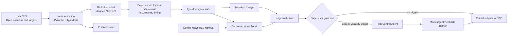
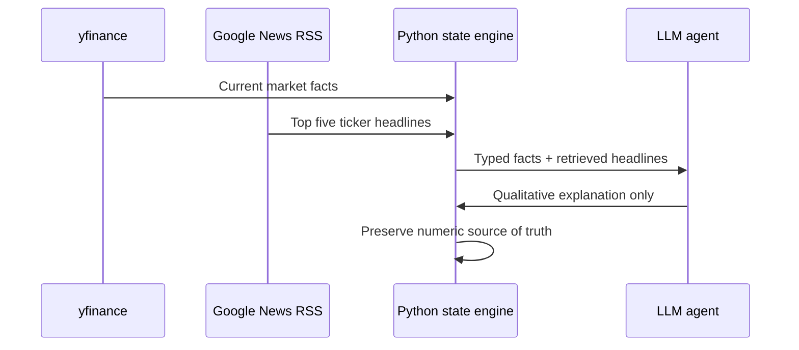

# MudraSense AI Architecture

**Developed by:** Gaurav Joshi ([GitHub](https://github.com/joshigauravj-ops))

## 1. Executive Summary

MudraSense AI is a local-first portfolio intelligence system for open Indian NSE equity positions. It combines deterministic financial computation with retrieval-augmented generative AI:

- Python owns market data normalization, PnL arithmetic, validation, and risk thresholds.
- Retrieval tools obtain current market movement and Google News RSS headlines.
- Specialized LLM agents produce qualitative technical and corporate-news summaries.
- LangGraph coordinates the agent nodes and routes triggered portfolios to a risk-control path.
- Results are persisted into the user's local CSV while user-owned target fields remain unchanged.

The design deliberately separates **facts and calculations** from **language generation**. This is the central safety property of the project.

## 2. System Context

## 3. Runtime Components

| Component | Responsibility | Current implementation |
|---|---|---|
| `main.py` | Startup orchestration, CSV loading, refresh, agent handoff, CSV write-back | CLI and Streamlit launcher |
| `schemas/positions.py` | Typed contracts and validation | Pydantic models and `TypedDict` payloads |
| `market_tools.py` | Market retrieval, RSS retrieval, deterministic calculations | `yfinance`, `requests`, BeautifulSoup, `Decimal` |
| `analysis_graph.py` | Agent adapters, prompts, graph nodes, guardrail routing | LangGraph, Groq, Ollama |
| `dashboard.py` | Human-facing workflow interface | Streamlit |
| `.env.example` | Configuration contract | Provider, models, timeouts, thresholds |
| `examples/open_positions.template.csv` | Safe input template | User-owned input columns and examples |

## 4. End-to-End Data Flow

### Step 1: Validate user intent

The user supplies one row per open lot. Required identity fields include ticker, entry price, quantity, and trade date. Multiple rows may share a ticker because each row can represent a different entry date and price.

The loader normalizes symbols such as `RELIANCE` to `RELIANCE.NS` and validates the row with Pydantic. Target fields are treated as user-owned intent:

- `target price`
- `target profit`
- `target holding`
- Related trade fields such as action, strike price, and commission/STT

Invalid rows stop the workflow before any network or agent activity begins.

### Step 2: Retrieve current facts

`market_tools.py` retrieves daily market data through `yfinance` using NSE symbols with the `.NS` suffix. It records current price, high, low, net change, and the IST market-session status.

Google News RSS is retrieved for each ticker and parsed into up to five typed headline/timestamp records. TLS verification uses `certifi`, and network failures return structured error strings.

### Step 3: Compute financial values deterministically

The Python layer calculates net open PnL and percentage return using `Decimal` arithmetic. Buy and sell positions are handled differently, and commission/STT is deducted before persistence.

LLMs never calculate or modify:

- Prices
- Quantities
- PnL
- Percentages
- Loss totals
- Risk thresholds
- Stop-loss values

This makes the numerical output reproducible and auditable.

### Step 4: Run specialized agents

The graph runs two focused qualitative nodes:

1. **Technical Analyst** receives authoritative market metrics and indicators. It produces exactly two sentences describing immediate momentum as overbought, oversold, or neither.
2. **Corporate News and Sentiment Agent** receives only retrieved RSS headlines. It filters generic noise and prioritizes SEBI/regulatory filings, earnings, corporate actions, and governance updates.

Both prompts explicitly prohibit guessing or changing numerical financial data. The provider can be Groq or local Ollama, configured through `.env`.

### Step 5: Apply autonomous guardrails

The supervisor iterates over every open lot and evaluates deterministic conditions:

- Position PnL at or below the configured loss threshold.
- Intraday decline at or below the configured drop threshold.
- A negative intraday move combined with elevated India VIX.

A triggered portfolio routes to the Risk Control Agent. The agent drafts qualitative reasoning from supervisor-owned facts. Python calculates the total current loss and creates a typed `RiskAlertPayload`. The current webhook implementation prints an urgent banner; production endpoints can be added behind the same boundary.

### Step 6: Persist outputs

After a successful workflow, agent-owned fields are written back to the same CSV:

- Current market values and session status
- Authoritative PnL and PnL percentage
- Technical summary
- Breaking-news analysis
- Risk tier

Target-prefixed columns and user trade inputs are never used as write targets. Rows are matched by input order, which preserves repeated ticker lots safely.

## 5. Where RAG Fits

This project currently implements **live retrieval-augmented generation**, not a historical vector-search platform.

The retrieval pipeline is:

The important RAG principle is that the model receives grounded context retrieved for the current ticker instead of answering from general pretraining memory. The news agent can cite the supplied headlines in its reasoning, while the technical agent works from the latest calculated values.

### Practical future RAG extension

A production version could add a document-ingestion layer for NSE circulars, SEBI filings, earnings releases, and company announcements:

1. Fetch documents with source URL and publication date.
2. Extract and clean text.
3. Chunk documents with metadata such as ticker, source, date, and document type.
4. Embed and store chunks in a vector database.
5. Retrieve top-k relevant chunks for a ticker and analysis question.
6. Pass retrieved chunks to the news agent with citations.
7. Store the source references alongside the summary for auditability.

The current RSS retrieval is a useful first production slice because it delivers fresh context without requiring a paid API or a vector database.

## 6. Why This Is Agentic AI

This is more than a single chatbot prompt:

- **Specialization:** Technical and corporate-news reasoning have separate roles and prompts.
- **Shared state:** LangGraph carries typed portfolio context between nodes.
- **Conditional routing:** The supervisor chooses whether the risk-control branch runs.
- **Tool use:** Agents consume outputs from market and news retrieval tools.
- **Guardrails:** Deterministic Python remains authoritative for financial facts.
- **Persistence:** The workflow writes useful analysis back to the portfolio record.

The LLMs are reasoning components inside a controlled workflow, not the system of record.

## 7. Reliability and Security Controls

- `.NS` normalization prevents accidental routing to the wrong exchange symbol.
- Pydantic rejects malformed or unexpected fields.
- `Decimal` arithmetic avoids binary floating-point surprises in money calculations.
- Network calls have timeouts and structured failure handling.
- TLS verification is enabled with `certifi`.
- `.env` is ignored by git; `.env.example` contains no secrets.
- CSV validation completes before market or agent work starts.
- Agent prompts prohibit numerical hallucination.
- Target columns are immutable from the agent write-back path.

## 8. Interview Showcase Narrative

> I built a local-first agentic portfolio monitor for Indian equities. The design separates deterministic computation from generative reasoning: Python validates positions, retrieves NSE data, calculates net PnL, and enforces risk thresholds, while specialized LangGraph nodes summarize technical momentum and corporate news. Google News RSS provides live retrieved context for the news agent, making the current system a lightweight RAG pipeline. A supervisor node evaluates every open lot and conditionally routes breached portfolios to a Risk Control Agent, which drafts an alert without being allowed to alter financial numbers. The architecture is auditable because every model output is grounded in typed state, and the CSV preserves user intent while receiving refreshed market and analysis fields.

### Strong follow-up points

- Why not let the LLM calculate PnL? Numerical reproducibility, auditability, and risk control.
- Why use multiple agents? Smaller role-specific prompts are easier to evaluate and constrain.
- Why LangGraph? Explicit state transitions and conditional routing make the workflow observable.
- Is this full RAG? It is live RSS-based RAG today; a vector store for filings is the natural next extension.
- How would it scale? Replace CSV persistence with PostgreSQL, add a document/vector store, introduce job scheduling, and send signed webhook notifications.

## 9. Production Evolution

The next architecture steps are:

1. Replace CSV persistence with PostgreSQL while retaining the Pydantic contracts.
2. Add a document store and vector database for historical filings and news.
3. Add source citations and confidence metadata to agent outputs.
4. Add real Discord/Telegram integrations with secrets from environment or a secret manager.
5. Add tests for market-data adapters, graph routing, prompt contracts, and persistence.
6. Add observability for latency, provider errors, retrieval quality, and alert decisions.
